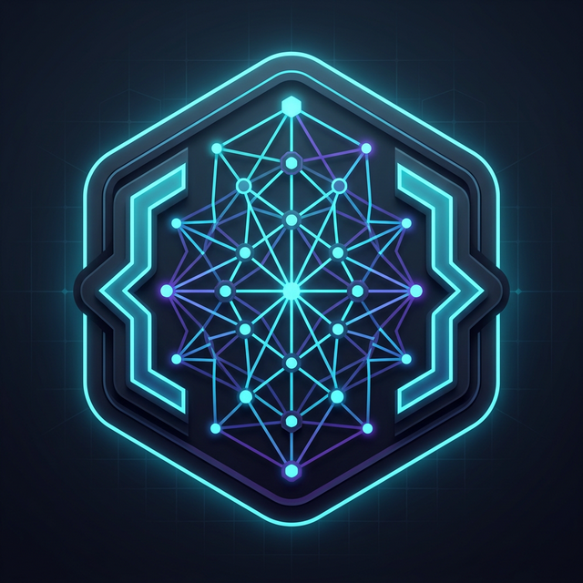

<p align="center">
  <a href="https://github.com/eltonjosesouza/sdd-skills-ai">
    <picture>
      <source srcset="assets/sdd-skills-ai-logo.png">
      
    </picture>
  </a>
</p>

<p align="center">
  <a href="https://github.com/eltonjosesouza/sdd-skills-ai/actions/workflows/ci.yml"></a>
  <a href="https://www.npmjs.com/package/sdd-skills-ai"></a>
  <a href="./LICENSE"></a>
  <a href="https://discord.gg/YctCnvvshC"></a>
</p>

<details>
<summary><strong>The universal agentic IDE boilerplate.</strong></summary>

[](https://github.com/eltonjosesouza/sdd-skills-ai/stargazers)
[](https://www.npmjs.com/package/sdd-skills-ai)
[](https://github.com/eltonjosesouza/sdd-skills-ai/graphs/contributors)

</details>
<p></p>
Our philosophy:

```text
→ wizard-driven not command-heavy
→ complete not partial
→ Scrum-first not ad-hoc
→ built for teams not just individuals
→ scalable from solo to enterprise
```

> [!TIP]
> **Complete Scrum methodology now built-in!** We've integrated full SDD+TDD+DDD Scrum with 9 specialized AI agents.
>
> Run `npx sdd-skills-ai wizard` to get started. → [Learn more here](docs/scrum/overview.md)

<p align="center">
  Follow <a href="https://github.com/eltonjosesouza">eltonjosesouza on GitHub</a> for updates · Join the <a href="https://github.com/eltonjosesouza/sdd-skills-ai/discussions">GitHub Discussions</a> for help and questions.
</p>

## See it in action

```text
You: npx sdd-skills-ai wizard
AI:  🧙‍♂️ Welcome to the SDD Skills AI Wizard!
     ✓ Spec-Kit initialized (default)
     ✓ 23 AI tools configured
     ✓ Community skills added
     ✓ Complete Scrum methodology installed
     ✓ 9 specialized agents ready
     Your AI-driven development environment is ready!

You: @scrum.product-owner Help me define user authentication
AI:  I'll help you create a complete user story:
     ✓ User story with acceptance criteria
     ✓ Business constraints and success metrics
     ✓ Technical requirements overview
     Ready for contract phase!

You: /scrum.feature-lifecycle
AI:  Starting complete 6-phase development:
     ✓ Phase 1: Discovery & Definition
     ✓ Phase 2: Contract Creation
     ✓ Phase 3: Sprint Planning
     ✓ Phase 4: Development (TDD)
     ✓ Phase 5: Validation
     ✓ Phase 6: Release & Feedback
     Feature complete and deployed!
```

<details>
<summary><strong>Complete Development Environment</strong></summary>

<p align="center">
  
</p>

</details>

## Quick Start

**Requires Node.js 18.0.0 or higher.**

Install SDD Skills AI globally:

```bash
npm install -g sdd-skills-ai
```

Then navigate to your project directory and run the wizard:

```bash
cd your-project
sdd-skills-ai wizard
```

Now tell your AI: `@scrum.product-owner <what-you-want-to-build>`

> [!NOTE]
> Not sure if your AI tool is supported? [View the full list](docs/supported-tools.md) – we support 23+ tools and growing.
>
> Also works with pnpm, yarn, and bun. [See installation options](docs/installation.md).

## Docs

→ **[Getting Started](docs/getting-started.md)**: first steps<br>
→ **[Quick Start](docs/quick-start.md)**: 5-minute tutorial<br>
→ **[CLI Reference](docs/cli.md)**: complete command reference<br>
→ **[Scrum Overview](docs/scrum/overview.md)**: complete methodology<br>
→ **[Supported Tools](docs/supported-tools.md)**: 23 AI assistants<br>
→ **[Installation](docs/installation.md)**: detailed setup guide<br>
→ **[FAQ](docs/faq.md)**: frequently asked questions<br>
→ **[Troubleshooting](docs/troubleshooting.md)**: common issues

## Why SDD Skills AI?

AI coding assistants are powerful but lack structure and methodology. SDD Skills AI adds a complete development layer so you can build with discipline, quality, and team collaboration.

- **Build with discipline** — SDD+TDD+DDD methodology ensures quality before code gets written
- **Collaborate effectively** — 9 specialized Scrum agents with clear roles and responsibilities
- **Stay organized** — complete 6-phase development from discovery to release
- **Use your tools** — works with 23+ AI assistants via agent configurations
- **Scale infinitely** — from personal projects to enterprise teams

## Teams

Using SDD Skills AI in a team? [Join our GitHub Discussions](https://github.com/eltonjosesouza/sdd-skills-ai/discussions) for collaboration tips and best practices.

---

## License

MIT © [sdd-skills-ai contributors](https://github.com/eltonjosesouza/sdd-skills-ai)
